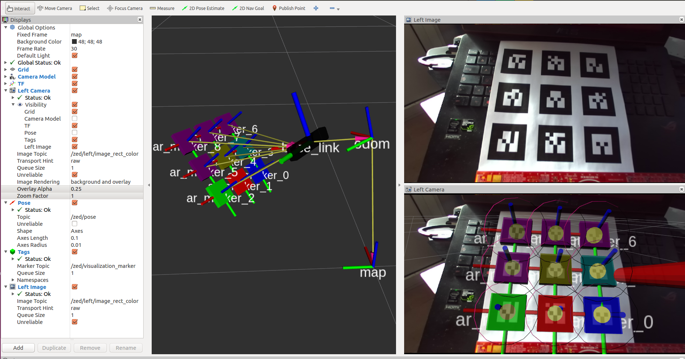
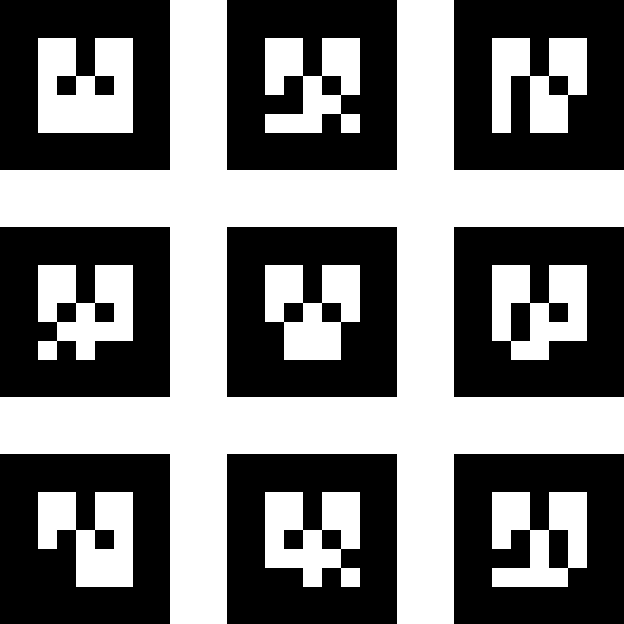
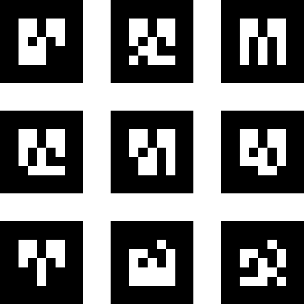

# Stereolabs ZED Camera - Alvar AR tag example

This package shows how to use the ZED Wrapper with [ar_track_alvar](http://wiki.ros.org/ar_track_alvar) to detect AR markers and localize them in the space.

The [ar_track_alvar](http://wiki.ros.org/ar_track_alvar) package is a ROS wrapper for [Alvar](http://virtual.vtt.fi/virtual/proj2/multimedia/index.html), an open source AR tag tracking library.

## Install the ar_track_alvar package

Open a terminal and launch
    
    $ sudo apt install ros-kinetic-ar-track-alvar

## Run the program

To launch the example, open a terminal and launch:

    $ roslaunch zed_ar_track_alvar_example zed_ar_track_alvar.launch

The launch file automatically starts the `zed_wrapper` node, the `ar_track_alvar` node and `RVIZ` with a preconfigured view:



* the `Left Image` view shows the RGB stream from the left camera of the ZED.
* the `Left Camera` view shows the "world" as seen by the left camera. The `TF` and the `Tags` are selected to be shown in 3D projection
* the 3D view shows the ZED camera localized in the space and the position of the `Tags` as coloured markers.

*Note* It is important to subscribe the `/zed/pose` topic to be able to localize the camera in the space.

*Note* the tags used in the example are available following this [link](images/markers0to8.png)

## The launch file explained

To use the ZED wrapper with the `ar_track_alvar` node we need to correctly set the following ar_track_alvar parameters:

- `camera_image` -> the name of the topic that provides camera frames for detecting the AR tags.
- `camera_info` -> the name of the topic of camera parameters used to correctly localize the tag in the 3D world
- `output_frame` -> the name of the TF frame associated to the camera position

It is important that the `zed_wrapper` node and the `ar_track_alvar` node use the same values for these three parameters to be able to correctly communicate.

The values associated to the above parameters are the following:

```
    <arg name="cam_image_topic"         default="rgb/image_rect_color" />
    <arg name="cam_info_topic"       	default="rgb/camera_info" />
    <arg name="camera_frame"            default="zed_left_camera_frame" />
```

The corresponding parameters of the ZED node are the following:

- `cam_image_topic` -> `rgb_topic`
- `cam_info_topic` -> `rgb_info_topic`
- `camera_frame` -> `left_camera_frame`

The corresponding parameters of the `rtabmap_ros` node are the following:

- `cam_image_topic` -> `camera_image`
- `cam_info_topic` -> `camera_info`
- `camera_frame` -> `output_frame`

It is also important to set the correct `marker_size` in centimeters. Better if the real size of the markers is measured after printing them:

    <arg name="marker_size" default="5.0" />
    
Other parameters that can be tuned:           
* `max_new_marker_error` -> A threshold determining when new markers can be detected under uncertainty
* `max_track_error` -> A threshold determining how much tracking error can be observed before an tag is considered to have disappeared

Their values in the launch file:

    <arg name="max_new_marker_error" default="0.08" />   
    <arg name="max_track_error" default="0.2" />

## Markers

Following two examples of markers with ID numbers from 0 to 17:





