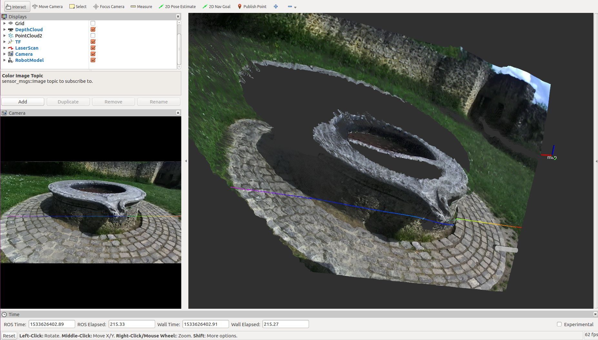

# Stereolabs ZED Camera - ROS Nodelet example

`zed_nodelet_example` is a ROS package to illustrate how to load the `ZEDWrapperNodelet` with an external nodelet manager and use the intraprocess communication to generate a virtual laser scan thanks to the nodelet `depthimage_to_laserscan`

## Run the program

To launch the wrapper nodelet along with the `depthimage_to_laserscan` nodelet, open a terminal and launch:

`$ roslaunch zed_nodelet_example zed_nodelet_laserscan.launch`

**Note**: Remember to change the parameter `camera_model` to `0` if you are using a **ZED** or to `1` if you are using a **ZED Mini**

## Visualization
To visualize the result of the process open Rviz, add a `LaserScan` visualization and set `/zed/scan` as `topic` parameter

Virtual 2D laser scan rendered in Rviz. You can see the projection of the virtual laser scan on the RGB image on the left


Virtual 2D laser scan rendered in Rviz over the 3D depth cloud. You can see the projection of the virtual laser scan on the RGB image on the left


## The launch file explained
The launch file executes three main operations:

1. Runs the Nodelet manager
2. Load the ZED nodelet
3. Load the `depthimage_to_laserscan` nodelet

To run the Nodelet Manager we use the following line instruction:

```<node pkg="nodelet" type="nodelet" name="$(arg nodelet_manager_name)"  args="manager" output="screen" />```

the Nodelet Manager is the process that loads the ZED and the depthimage_to_laserscan nodelets and that allows them to us intra-process communication to pass elaboration data. 

The "variable" `nodelet_manager_name` is defined here:

```<arg name="nodelet_manager_name" default="zed_nodelet_manager" />```

The ZED nodelet is loaded using its own nodelet launch file:

```<include file="$(find zed_wrapper)/launch/zed_camera_nodelet.launch">```

called passing the "variable" `nodelet_manager_name` as parameter:

```<arg name="nodelet_manager_name" value="$(arg nodelet_manager_name)" />```

The `DepthImageToLaserScanNodelet` nodelet is loaded with the following commands:
```
        <node pkg="nodelet" type="nodelet" name="depthimage_to_laserscan" args="load depthimage_to_laserscan/DepthImageToLaserScanNodelet zed_nodelet_manager">
             <param name="scan_height" value="10"/>
             <param name="output_frame_id" value="$(arg left_camera_frame)"/>
             <param name="range_min" value="0.45"/>
             <remap from="image" to="$(arg depth_topic)"/>
        </node>
```

it is really important to notice these two lines:

```<param name="output_frame_id" value="$(arg left_camera_frame)"/>```

```<remap from="image" to="$(arg depth_topic)"/>```

The first line tells to the `depthimage_to_laserscan` nodelet which is the frame name of the virtual scan message.

The second line tells to the `depthimage_to_laserscan` nodelet which is the depth image topic to use to extract the information to generate the virtual laser scan. 

For the description of the other parameters please refer to the [documentation of the `depthimage_to_laserscan` package](http://wiki.ros.org/depthimage_to_laserscan)


