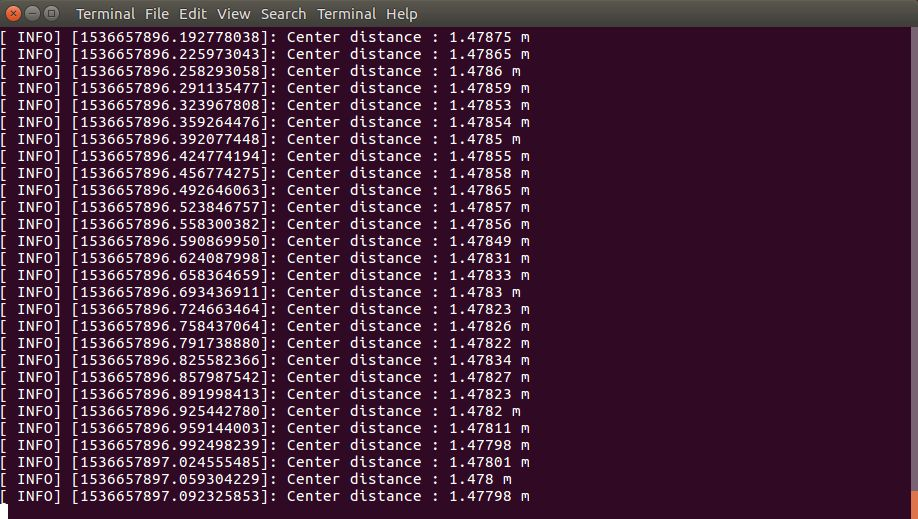

# Depth subscription tutorial

In this tutorial you will learn how to write a simple node that subscribes to messages of type sensor_msgs/Image to retrieve the depth images published by the ZED node and to get the measured distance at the center of the image

The complete documentation is available on the [Stereolabs website](https://docs.stereolabs.com/integrations/ros/depth_sensing/)

