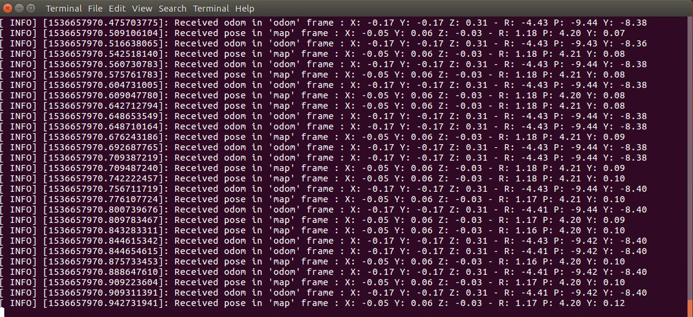

# Positional Tracking tutorial

In this tutorial you will learn how to write a simple node that subscribes to messages of type
`geometry_msgs/PoseStamped` and `nav_msgs/Odometry` to retrieve the position and the orientation of the ZED camera in the `map` and in the `odometry` frames.

In this tutorial you will learn how to write a simple node that subscribes to messages of type `geometry_msgs/PoseStamped` and `nav_msgs/Odometry` to retrieve the position and the orientation of the ZED camera in the map and in the odometry frames.

The complete documentation is available on the [Stereolabs website](https://docs.stereolabs.com/integrations/ros/positional_tracking/)
