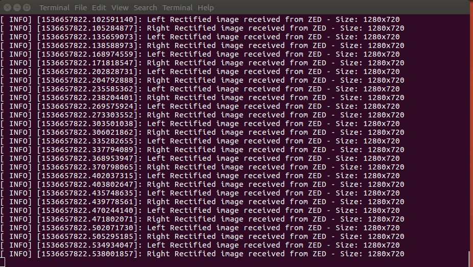

# ZED video subscription tutorial

In this tutorial you will learn how to write a simple node that subscribes to messages of type sensor_msgs/Image to retrieve the Left and Right rectified images published by the ZED node.

The complete documentation is available on the [Stereolabs website](https://docs.stereolabs.com/integrations/ros/video/)
