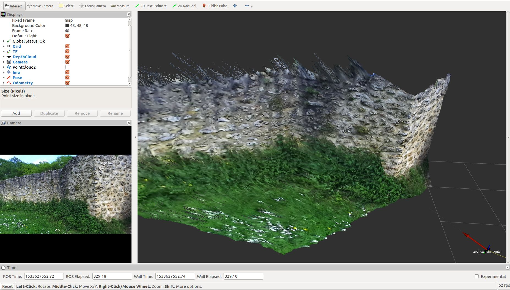
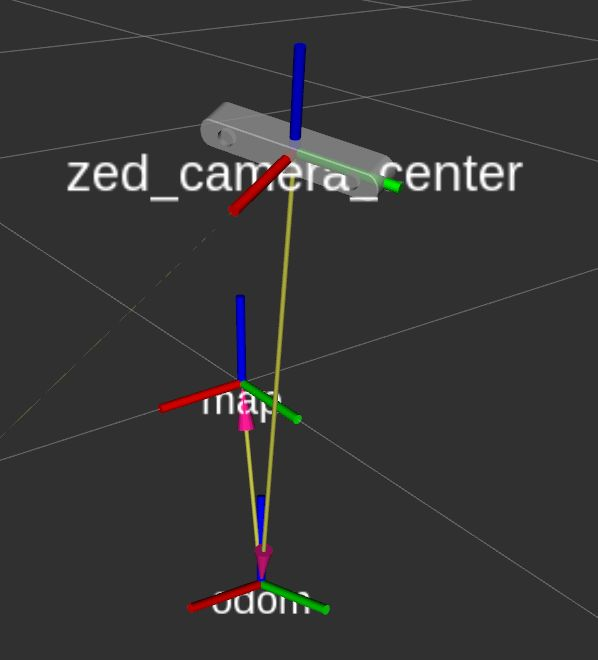

# Stereolabs ZED Camera - ROS Display example

This package lets you visualize in the RViz application all the possible information that can be acquired using a ZED camera.

### Run the program

If you own a ZED camera launch:

    $ roslaunch zed_display display.launch

If you own a ZED Mini camera launch:

    $ roslaunch zed_display display_zedm.launch

[More](https://www.stereolabs.com/documentation/guides/using-zed-with-ros/introduction.html)
