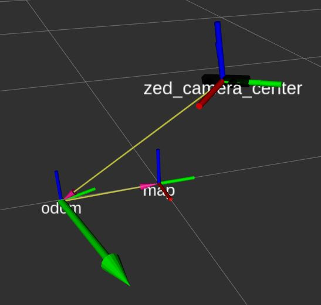

# Stereolabs ZED Camera - ROS Display package

This package lets you visualize in the [ROS RViz application](http://wiki.ros.org/rviz) all the
possible information that can be acquired using a Stereolabs camera.
The package provides the launch files for ZED, ZED Mini and ZED 2 camera models.

**Note:** The main package [zed-ros-wrapper](https://www.stereolabs.com/documentation/guides/using-zed-with-ros/introduction.html)
is required to correctly execute the ROS node to acquire data from a Stereolabs 3D camera.

## Prerequisites
 - Ubuntu 16.04 or newer
 - [ZED SDK **≥ 3.0**](https://www.stereolabs.com/developers/) and its dependency [CUDA](https://developer.nvidia.com/cuda-downloads)
 - [ROS Kinetic](http://wiki.ros.org/kinetic/Installation/Ubuntu) or newer
 - [zed-ros-wrapper](https://www.stereolabs.com/documentation/guides/using-zed-with-ros/introduction.html)

### Installation
The *zed_display_rviz* is a catkin package. It depends on the following ROS packages:
- rviz
- rviz_imu_plugin
- zed_wrapper

Install the [zed-ros-wrapper](https://www.stereolabs.com/documentation/guides/using-zed-with-ros/introduction.html) package
following [installationthe guide](https://github.com/stereolabs/zed-ros-wrapper#installation)

Open a terminal and clone the package in your catkin workspace:
    $ mkdir -p ~/catkin_ws/src
    $ cd ~/catkin_ws/src
    $ git clone https://github.com/stereolabs/zed-ros-display-rviz.git
    $ cd ../

Automatically satisfy all the dependencies
    $ rosdep install --from-paths src --ignore-src -r -y

**Note**: This command magically installs all the packages that the packages in your catkin workspace depend upon
but are missing on your computer.

No further compilation is required.

### Execution

If you own a ZED camera launch:
    $ roslaunch zed_display display_zed.launch

If you own a ZED Mini camera launch:
    $ roslaunch zed_display display_zedm.launch

If you own a ZED 2 camera launch:
    $ roslaunch zed_display display_zed2.launch

[Detailed information](https://www.stereolabs.com/documentation/guides/using-zed-with-ros/introduction.html)
