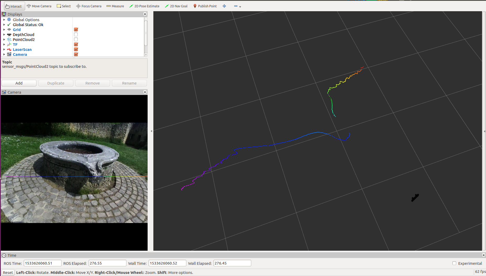
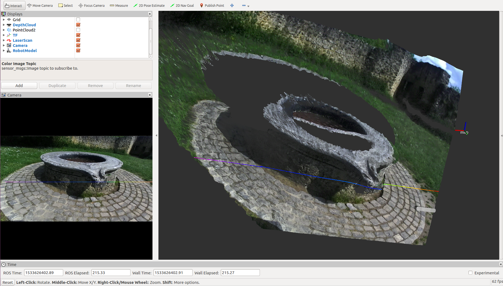

# Stereolabs ZED Camera - ROS Nodelet example

`zed_nodelet_example` is a ROS package to illustrate how to load the `ZEDWrapperNodelet` with an external nodelet manager and use the intraprocess communication to generate a virtual laser scan thanks to the nodelet `depthimage_to_laserscan`

### Run the program

To launch the wrapper nodelet along with the `depthimage_to_laserscan` nodelet, open a terminal and launch:

`$ roslaunch zed_nodelet_example zed_nodelet_laserscan.launch`

**Note**: Remember to change the parameter `camera_model` to `0` if you are using a **ZED** or to `1` if you are using a **ZED Mini**

## Visualization
To visualize the result of the process open Rviz, add a `LaserScan` visualization and set `/zed/scan` as `topic` parameter

Virtual 2D laser scan rendered in Rviz. You can see the projection of the virtual laser scan on the RGB image on the left

Virtual 2D laser scan rendered in Rviz over the 3D depth cloud. You can see the projection of the virtual laser scan on the RGB image on the left

[More](https://www.stereolabs.com/documentation/guides/using-zed-with-ros/introduction.html)
