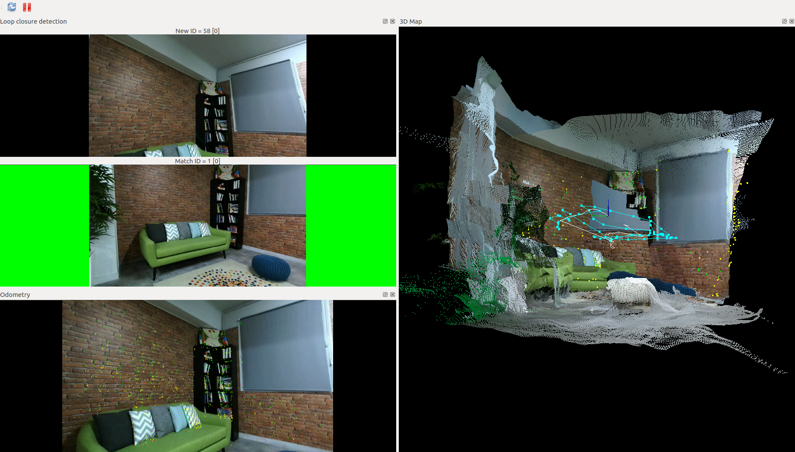

# Stereolabs ZED Camera - RTAB-map example

This package shows how to use the ZED Wrapper with [RTAB-map](http://introlab.github.io/rtabmap/)

### Run the program

To launch the example, open a terminal and launch:

    $ roslaunch zed_rtabmap_example zed_rtabmap.launch

Example of indoor 3D mapping using RTAB-map and ZED

