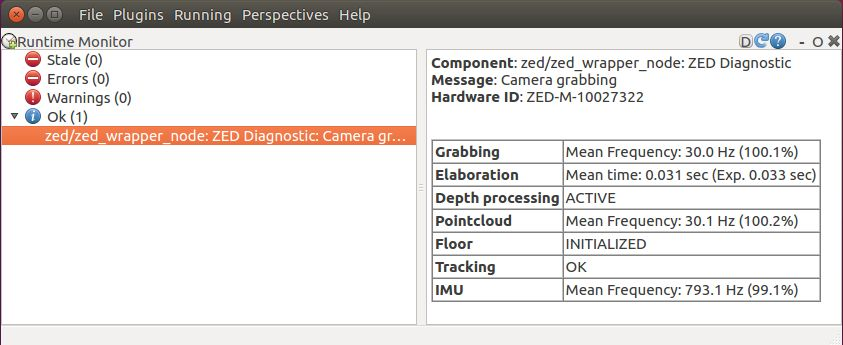

# Stereolabs ZED Camera - ROS Integration

This package lets you use the ZED stereo camera with ROS. It outputs the camera left and right images, depth map, point cloud, pose information and supports the use of multiple ZED cameras.

[More information](https://www.stereolabs.com/documentation/guides/using-zed-with-ros/introduction.html)

## Getting started

- First, download the latest version of the ZED SDK on [stereolabs.com](https://www.stereolabs.com/developers/)
- [Install](#build-the-program) the ZED ROS wrapper
- For more information, check out our [ROS documentation](https://www.stereolabs.com/documentation/guides/using-zed-with-ros/introduction.html). If you want to customize the wrapper, check the [ZED API documentation](https://www.stereolabs.com/developers/documentation/API/)

### Prerequisites

- Ubuntu 16.04 or newer (Ubuntu 18 recommended)
- [ZED SDK **≥ 3.0**](https://www.stereolabs.com/developers/) and its dependency [CUDA](https://developer.nvidia.com/cuda-downloads)
- [ROS Kinetic](http://wiki.ros.org/kinetic/Installation/Ubuntu) or [ROS Melodic](http://wiki.ros.org/melodic/Installation/Ubuntu)

### Build the program

The zed_ros_wrapper is a catkin package. It depends on the following ROS packages:

   - nav_msgs
   - tf2_geometry_msgs
   - message_runtime
   - catkin
   - roscpp
   - stereo_msgs
   - rosconsole
   - robot_state_publisher
   - urdf
   - sensor_msgs
   - image_transport
   - diagnostic_updater
   - dynamic_reconfigure
   - tf2_ros
   - message_generation
   - nodelet

Open a terminal, clone the repository, update the dependencies and build the packages:

    $ cd ~/catkin_ws/src
    $ git clone https://github.com/stereolabs/zed-ros-wrapper.git
    $ cd ../
    $ rosdep install --from-paths src --ignore-src -r -y
    $ catkin_make -DCMAKE_BUILD_TYPE=Release
    $ source ./devel/setup.bash

### Run the program

To launch the ZED node use:

  - ZED camera: `$ roslaunch zed_wrapper zed.launch`
  - ZED Mini camera: `$ roslaunch zed_wrapper zedm.launch`
  - ZED2 camera: `$ roslaunch zed_wrapper zed2.launch`

 To select the ZED from its serial number: 
    `$ roslaunch zed_wrapper zed.launch serial_number:=1010 #replace 1010 with the actual SN`

### Parameters
To configure the features of the ZED node you can modify the configuration YAML files in the `params` folder.
A detailed description of each parameter is available in the [official online documentation](https://www.stereolabs.com/documentation/guides/using-zed-with-ros/introduction.html).

### SVO recording
[SVO recording](https://www.stereolabs.com/docs/video/#video-recording) can be started and stopped while the ZED node is running using the service `start_svo_recording` and the service `stop_svo_recording`.
[More information](https://www.stereolabs.com/docs/ros/zed_node/#services)

### Object Detection
The SDK v3.0 introduces the Object Detection and Tracking module. **The Object Detection module is available only with a ZED 2 camera**. 
The Object Detection can be enabled automatically when the node start setting the parameter `object_detection/od_enabled` to `true` in the file `zed2.yaml`.
The Object Detection can be enabled/disabled manually calling the services `start_object_detection` and `stop_object_detection`.

### Spatial Mapping
The Spatial Mapping can be enabled automatically when the node start setting the parameter `mapping/mapping_enabled` to `true` in the file `common.yaml`.
The Spatial Mapping can be enabled/disabled manually calling the services `start_3d_mapping` and `stop_3d_mapping`.

### Diagnostic
The ZED node publishes diagnostic information that can be used by the robotic system using a [diagnostic_aggregator node](http://wiki.ros.org/diagnostic_aggregator).

With the `rqt` plugin `Runtime monitor`, it is possible to retrieve all the diagnostic information, checking that the node 
is working as expected.

### 2D mode
For robots moving on a planar surface it is possible to activate the "2D mode" (parameter `tracking/two_d_mode` in `common.yaml`). 
The value of the coordinate Z for odometry and pose will have a fixed value (parameter `tracking/fixed_z_value` in `common.yaml`). 
Roll and pitch and relative velocities will be fixed to zero.

### Diagnostic
The ZED node publishes diagnostic information that can be used by the robotic system using a [diagnostic_aggregator node](http://wiki.ros.org/diagnostic_aggregator).

With the `rqt` plugin `Runtime monitor`, it is possible to retrieve all the diagnostic information, checking that the node is working as expected:

A brief explanation of each field:

  -  `Component`: name of the diagnostic component
  -  `Message`: summary of the status of the ZED node
  -  `HardwareID`: Model of the ZED camera and its serial number
  -  `Capture`: grabbing frequency (if video or depth data are subscribed) and the percentage respect to the camera frame rate
  -  `Processing time`: time in seconds spent to elaborate data and the time limit to achieve max frame rate
  -  `Depth status`: indicates if the depth processing is performed
  -  `Point Cloud`: point cloud publishing frequency (if there is at least a subscriber) and the percentage respect to the camera frame rate
  -  `Floor Detection`: if the floor detection is enabled, indicates if the floor has been detected and the camera position correctly initialized
  -  `Tracking status`: indicates the status of the tracking, if enabled
  -  `IMU`: the publishing frequency of the IMU topics, if the camera is the ZED Mini and there is at least a subscriber

[Detailed information](https://www.stereolabs.com/documentation/guides/using-zed-with-ros/introduction.html)

